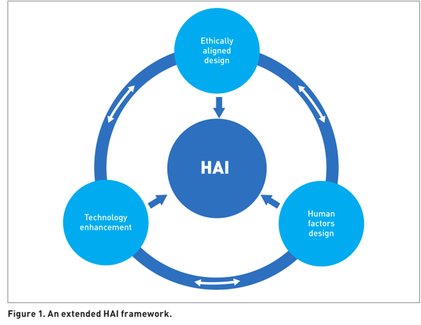

## Human-Centered Data, Modeling, and AI
## Summary:
---
We have reached a truly historic turning point, human society is being reshaped faster and more profoundly by technology. Started from the birth of the World Wide Web, driven by the rapidly growing data and computing power, the most disruptive changes can be traced back to the recent development of Artificial Intelligence (AI).

Like any powerful tool, AI promises the same level of risk and reward. In the past 10 years, the development and use of AI is a decentralized global phenomenon with relatively low barriers to entry. We have seen that AI-generated content makes it more and more difficult to tell facts from the fiction; recent examples of machine learning deviations showed how our technology can easily magnify prejudice and inequality. Therefore, the frontier of AI cannot be just technology, it must also be humanistic. 

Then how do we improve or adjust our web system to alleviate the existing issue, to help AI becoming more humanistic? Like, how do we preserving privacy when we design a new social network? How do we obtain unbiased sampling in temporal and spatial dimensions, or semantic dimensions? How do we establish anti-bias learning models to avoid Ecological Fallacy? Particularly, when social media are not only offering almost infinite data to related subjects but also influence both online and offline user behavior in a various way, itself should play a vital role on every aspect of human-centered data, modeling, and AI.  

### Programme Committe:
Professor Tuo Leng (Shanghai University)  
Professor Xiaodong Yue (Shanghai University)  
Professor Yinmin Wang (Shanghai University)  
Professor Yin Li (Shanghai University)  

### Organizing Committe:   
Tuo Leng (Shanghai University)  
Xiaodong Yue (Shanghai University)  
Runan Wang  (Shanghai University)  
Yifan Wang  (Shanghai University)  
Yiwen Huang  (Shanghai University)  

### Registration
To register for this workshop as part of the WebSci'20 conference, please visit: [https://websci20.webscience.org/](https://websci20.webscience.org/)

&nbsp;

## Description:
---

### Motivation:
Despite the enormous data brought by the Web, the quality of social network data is often difficult to guarantee. In addition to the representativeness of the data itself, the process of obtaining data usually runs into biased sampling in statistics, temporal-spatial dimensions, or even semantic dimensions. Thus the conclusions and decisions obtained may remain unaccountable. Recent works on Counterfactual and Casual Reasoning show a very positive result on anti-bias modeling, yet the whole interdisciplinary field is still under-explored.

On the other hand, although social media data is mega in size, the data dimension is usually relatively single and is considered a kind of "thin data". For instance, we can easily obtain the user's social media content, but the age, gender, occupation, and other more detailed information is still hard to observe. This will cause modeling to easily fall into "Ecological Fallacy". Therefore the privacy preserving and related ethic discussion have been integrated into much intersectional research. For instance, the combination of Differential Privacy and Generative Adversarial Networks (GAN) in recent work is showing the ability to alleviate the issue.

By this workshop, we hope some sparkles from the world-leading insightful minds that can inspire the participants' research on a new Reasonable, Interpretable, and Human-Centered AI paradigm. 

### Goals:
Our goal is to develop Human-Centered AI (HAI) around the core and multidisciplinary nature of Web Science. To discuss in the context of some global challenges such as COVID-19 is the key to embedding a new paradigm of AI into the after-pandemic world. More importantly, Web-based data, structures, and skills should guide AI to enhance our humanity, not to reduce or replace it.
 

## Schedule:
---
### 24th June Morning
Keynote 1: 10:00-10:30  
Keynote 2: 10:30-11:00  
Keynote 3: 11:00-11:30  

### 24th June Afternoon
Oral Presentation 1: 14:00-14:20  
Oral Presentation 2: 14:20-14:40  
Oral Presentation 3: 14:40-15:00  
Oral Presentation 4: 15:00-15:20  
Oral Presentation 5: 15:20-15:40  
Oral Presentation 6: 15:40-16:00    
Panel Discussion and Best Paper Reward: 16:00-17:00   

&nbsp;

## Target Audience:
---
Researchers who work or have interests in Web Science, Data Science, Data Economy, Data Mining, Privacy Preserving, Anti-Bias Modeling, Machine Learning, Automated Reasoning, Visualization Interactions, Natural Language Processing, Conversational AI, Machine Ethics, Value Alignment, AI Morality, etc.
 The estimated number of participants is around 50 with 8-10 papers.

## Primary Language:
---
English, Chinese

## Main Time Zone: 
---
GMT+8, (Beijing, Shanghai)  

## Related History:
---
No, this workshop has not been held in the past.

## Requirements:
---
The workshop will be delivered online, hence there are no special requirements for participants.

## Call for papers:
---
to be confirmed……
